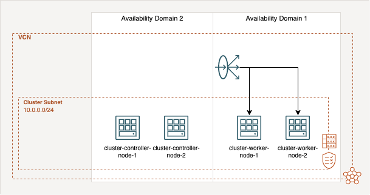

# Free k0s Cluster on the Oracle Cloud Infrastructure

The motivation of this project is to provide a [k0s](https://k0sproject.io/) cluster with four nodes fully automatically, which is composed only of always free infrastructure resources. The deployment will be done Terraform and the user-data scripts which installs k0s automatically and build up the cluster.

## Architecture
The cluster infrastructure based on four nodes, two server- and two agent-nodes for your workload. A load balancer which is distributes the traffic to your nodes on port 443. The server-nodes are at the availability domain 2 (AD-2) and the agent node are created in AD-1. The cluster use the storage solution [Longhorn](https://longhorn.io), which will use the block storages of the OCI instances and shares the Kubernetes volumes between them. The following diagram give an overview of the infrastructure.
<p align="center">
    
</p>

## Configuration
First of all, you need to setup some environment variables which are needed by the OCI Terraform provider. The [Oracle Cloud Infrastructure documentation](https://docs.oracle.com/en-us/iaas/developer-tutorials/tutorials/tf-provider/01-summary.htm) gives a good overview of where the IDs and information are located and also explains how to set up Terraform. 
```
export TF_VAR_compartment_id="<COMPARTMENT_ID>"
export TF_VAR_region="<REGION_NAME>"
export TF_VAR_tenancy_ocid="<TENANCY_OICD>"
export TF_VAR_user_ocid="<USER_OICD>"
export TF_VAR_fingerprint="<RSA_FINGERPRINT>"
export TF_VAR_private_key_path="<PATH_TO_YOUR_PRIVATE_KEY>"
export TF_VAR_ssh_authorized_keys='["<SSH_PUBLIC_KEY>"]'
```

## Requirements
- [Terraform](https://github.com/hashicorp/terraform)
- [k0sctl](https://github.com/k0sproject/k0sctl)

## Deployment
The deployment is a straight forwards process. First, start with a Terraform init:
```
terraform init
```
Second, you have to create a Terraform plan by this command:
```
terraform plan -out .tfplan
```
And last apply the plan:
```
terraform apply ".tfplan"
```

After a couple minutes the OCI instances are created now you have to start the deployment of k0s:
```
terraform output -raw k0s_cluster | k0sctl apply --config -
```
To get the kubeconfig run the following command:
```
terraform output -raw k0s_cluster | k0sctl kubeconfig --config - > ~/.kube/config
```

Now you can use ```kubectl``` to manage your cluster and check the nodes:
```
kubectl get nodes
```

## Longhorn Installation
Finally, you have to deploy [Longhorn](https://longhorn.io) the distributed block storage by the following commands of the ```kubectl``` or ```helm``` method:

Method 1 by ```kubectl```:
```
kubectl apply -f https://raw.githubusercontent.com/longhorn/longhorn/v1.2.4/deploy/longhorn.yaml
```

Method 2 by ```helm```:
You can find a shell script with all commands in the ```services``` folder which run all the following commands at once.
```
helm repo add longhorn https://charts.longhorn.io
helm repo update
kubectl create namespace longhorn-system
helm install longhorn longhorn/longhorn --namespace longhorn-system
```

Check the Longhorn ```storageclass```:
```
kubectl get storageclass
```

After a some minutes all pods are in the running state and you can connect to the Longhorn UI by forwarding the port to your machine:
```
kubectl port-forward deployment/longhorn-ui 8000:8000 -n longhorn-system
```

Use this URL to access the interface: ```http://127.0.0.1:8000``` .
